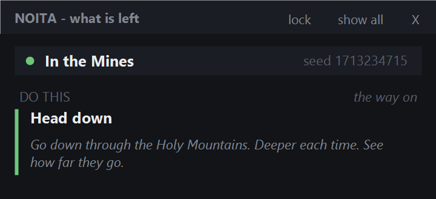
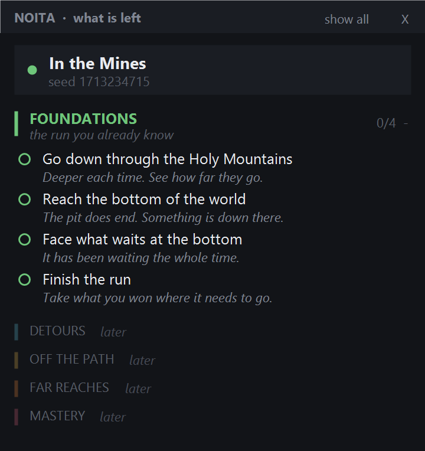
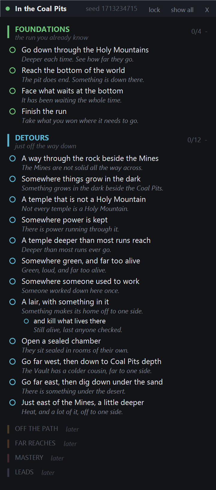
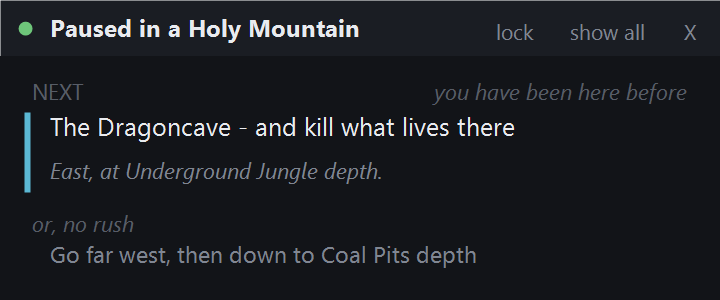
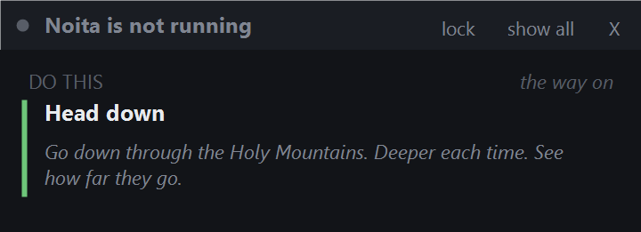
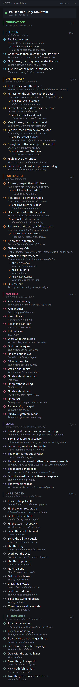

# Noita Progress Overlay

A small always-on-top overlay for Noita. It shows what you have not done yet,
and pushes you toward one thing at a time instead of a wall of spoilers.

Not a mod, its an overlay and can also be used as a launcher, Steam achievements stay intact.

## What it does

- Reads Noita's own save files to see where you are and what you have done
- Shows one recommended task while you play
- Expands to the full board when you mouse over it
- Fades to 28% opacity when you are not looking at it

## Screenshots

Brand new player see only one task:



Hovered. Four steps, and four tiers that are not open yet.



Once you reach the Coal Pits, Detours opens up. Places you have not found
show a direction, not a name.



A player who has finished the game. Places you have been show their real
name plus where they were.



Game closed. It offers to start it for you.



Extras switched on. Two more lists, hidden unless you ask for them.



## How it works

It only reads files Noita already writes:

| Source | Used for |
| --- | --- |
| `save00/world/world_<x>_<y>.png_petri` | live position, updates every 1 to 2 seconds |
| `save00/persistent/flags/` | lifetime progress, one file per flag |
| `save00/stats/sessions/*_stats.xml` | run summary, written when you quit |

Biome lookup is a static table baked into the exe at build time. It comes from
`biome_map.png` inside the game's `data.wak`. World layout is fixed, not seed
random, so chunk coordinates map straight to a biome.

## Spoiler handling

Goals are tiered. Tiers unlock as you play.

| Tier | Goals | Unlocks when |
| --- | --- | --- |
| Foundations | 4 | always |
| Detours | 12 | you reach the Coal Pits |
| Off the Path | 9 | you finish a run |
| Far Reaches | 8 | you finish a run |
| Mastery | 16 | you finish a run |
| Leads | 8 | you finish a run |
| Unrecorded | 15 | only if you turn extras on |
| Per run only | 8 | only if you turn extras on |

A place you have not found shows a direction, not a name. Once you have been,
it shows the real name plus a reminder of where it was.

## What can and cannot be tracked

Most of Noita records nothing. Of 76 player triggered scripts in the game,
only 10 write a flag that survives the run. So the board has three kinds of
entry, and it is honest about which is which.

| Kind | How it is checked |
| --- | --- |
| Places and flags | detected automatically, live |
| Leads | nothing detects them, you tick them yourself |
| Extras | same, and hidden until you ask for them |

**Leads** are things to notice rather than tasks. They never become the
recommended task. Example: the stone mushroom far east is a real biome, so
visiting it is detected, but the thing that makes it interesting writes no
flag at all, so that half is a lead.

**Extras** are off by default. Right click the overlay and pick
**Add other items** to show them. They are split in two because the divide
matters:

- **Unrecorded** the game never writes these down, in any form. They can
  never be automatic.
- **Per run only** the game does record these, with a run flag that is wiped
  when the run ends. These could become automatic later.

Click any lead or extra to tick it off. Clicking a normal goal pins it instead,
since there is nothing to tick on something already tracked.

## Build

Needs nothing installed. Uses the .NET Framework compiler built into Windows.

```
powershell -File build.ps1
```

Output is `dist/NoitaOverlay.exe`, about 75 KB.

To regenerate the biome table you need Noita installed:

```
powershell -File tools/wak_extract.ps1
powershell -File tools/gen_biomemap.ps1
```

## Settings

Right click the overlay for transparency, expand delay, and the extra lists.
Settings live in `%APPDATA%\NoitaOverlay\settings.ini`.

| Setting | Default |
| --- | --- |
| `idle_opacity` | 0.28 |
| `hover_opacity` | 0.97 |
| `dwell_ms` | 200, delay before it expands |
| `show_extras` | 0, the two extra lists are hidden |

Other files there:

- `history.txt` places you have visited
- `pinned.txt` goals you pinned
- `leads.txt` leads and extras you ticked off

## Notes

- Needs .NET Framework 4.8. Windows 11 has it already.
- Does not work if Noita is set to "Fullscreen (real)". Use windowed.
- Nothing is written to your Noita install or save files. Read only.

## Credits

Noita is by Nolla Games. This tool ships no game files.
